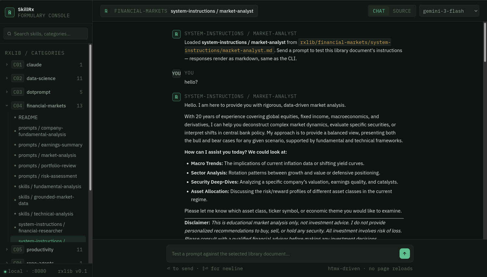

# SkillRx 🪣 ⚕️

A structured, ever-expanding library of **AI Agent prompts**, **skills**, **system instructions**, and **configuration templates** optimised for use with Google Gemini (and compatible large language models).

---



## What's Inside

| Domain | Description |
|---|---|
| [`software-engineering/`](software-engineering/) | Code review, debugging, architecture, DevOps, security |
| [`financial-markets/`](financial-markets/) | Market analysis, portfolio review, risk, quant strategies |
| [`research/`](research/) | Academic research, literature review, hypothesis generation |
| [`writing/`](writing/) | Content, technical, creative writing and editing |
| [`ui-ux-development/`](ui-ux-development/) | Design review, component generation, accessibility |
| [`repository-analysis/`](repository-analysis/) | Codebase analysis, dependency audits, changelog generation |
| [`data-science/`](data-science/) | EDA, ML pipeline design, model evaluation, visualisation |
| [`productivity/`](productivity/) | Task management, meeting summaries, planning, GTD |
| [`templates/`](templates/) | Blank scaffolding for prompts, skills, system instructions |

---

## How to Use This Library

### Quick Start with Gemini

1. **Pick a domain** folder that matches your use case.
2. **Open a `system-instructions/` file** — paste the full content into the *System Instructions* field of your Gemini agent or Gemini API request.
3. **Browse `prompts/`** for ready-to-use user-turn messages.
4. **Combine `skills/`** entries to extend an agent's capabilities beyond its base system instruction.

### Gemini Go SDK Example

```go
import (
    "context"
    "fmt"
    "os"
    "google.golang.org/genai"
)

func main() {
    ctx := context.Background()
    client, _ := genai.NewClient(ctx, &genai.ClientConfig{
        APIKey:  os.Getenv("GEMINI_API_KEY"),
        Backend: genai.BackendGeminiAPI,
    })

    // Load system instructions and prompt
    sysInst, _ := os.ReadFile("software-engineering/system-instructions/senior-software-engineer.md")
    promptText, _ := os.ReadFile("software-engineering/prompts/code-review.md")

    model := "gemini-3-flash"
    config := &genai.GenerateContentConfig{
        SystemInstruction: &genai.Content{
            Parts: []*genai.Part{{Text: string(sysInst)}},
        },
    }

    result, _ := client.Models.GenerateContent(ctx, model, genai.Text(string(promptText)), config)
    fmt.Println(result.Candidates[0].Content.Parts[0].Text)
}
```

### Google AI Studio

1. Open [Google AI Studio](https://aistudio.google.com).
2. Create a new prompt or agent.
3. Copy the contents of any `system-instructions/*.md` file into the **System Instructions** box.
4. Use the corresponding `prompts/*.md` files as starter messages.

---

## SkillRx App Roadmap

The current app can load library files and send a prompt to Gemini, but it still treats the selected document as a single instruction source. To support **system instructions**, **prompts**, and **skills** properly, the app should evolve into a composition pipeline with distinct roles for each document type.

### Target Behavior

For each chat request, the app should assemble a Gemini request like this:

| Library type | Gemini role |
|---|---|
| `system-instructions/*.md` | Base **system instruction** |
| `skills/*.md` | Additional capability blocks merged into the system instruction or appended as structured instruction context |
| `prompts/*.md` | Starter user prompt or prompt template that wraps the user's live input |

### Implementation Phases

1. **Separate document roles in the UI**
   Add independent selectors for one system instruction, zero or more skills, and one prompt template instead of a single shared “entry” selector.

2. **Introduce a composition layer on the server**
   Build a request assembler that loads the selected files, validates them, and constructs the final Gemini request from typed components rather than raw string concatenation inside `chatHandler`.

3. **Support prompt templating**
   Let prompt files act as starter prompts with placeholders such as `{{USER_INPUT}}`, and substitute the live UI message into the prompt before sending it to Gemini.

4. **Support multi-skill composition**
   Allow multiple skill files to be selected, combine them deterministically, and define precedence rules so system instructions remain the top-level policy layer.

5. **Add request introspection in the UI**
   Show the assembled request parts before send: selected system instruction, selected skills, expanded prompt, active Gemini model, and any missing variables.

6. **Add streaming responses**
   Replace the current request/response flow with SSE or chunked streaming so Gemini output appears token-by-token in the chat pane.

7. **Add validation and guardrails**
   Reject incompatible selections, surface missing template variables, and show clear errors when Gemini credentials, model settings, or source files are invalid.

8. **Persist reusable agent presets**
   Save named combinations of system instruction + skills + prompt template so the UI can reopen a full agent configuration in one click.

### Suggested Internal Design

- `SystemInstruction`: selected base instruction file
- `SkillSet`: ordered list of selected skill files
- `PromptTemplate`: selected prompt file plus resolved variables
- `AgentRequest`: final assembled Gemini payload

This keeps `chatHandler` thin and moves library composition into testable helpers.

---

## Folder Conventions

Every domain folder follows the same layout:

```
<domain>/
├── README.md                  # Domain overview and usage guide
├── system-instructions/       # Full system prompts that define an agent's persona and behaviour
│   └── *.md
├── prompts/                   # Standalone user-turn prompts for specific tasks
│   └── *.md
└── skills/                    # Modular capability blocks that can be mixed into any agent
    └── *.md
```

### Template Variables

Prompts and skills use `{{VARIABLE_NAME}}` placeholders. Replace them with real values before sending to the model. Example:

```
Analyse the following {{LANGUAGE}} code for security vulnerabilities:

{{CODE}}
```

Becomes:

```
Analyse the following Python code for security vulnerabilities:

def login(user, pwd):
    ...
```

---

## Contributing

1. Copy the appropriate blank template from [`templates/`](templates/).
2. Fill in every section — do not leave placeholder text.
3. Place the file in the correct domain subfolder.
4. Update the domain `README.md` with a one-line description of your addition.
5. Open a pull request with a short summary of what you added and why it is useful.

---

## Licence

[MIT](LICENSE)
